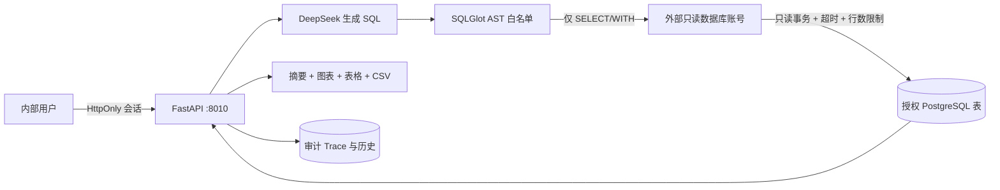

# 电商 SQL 数据分析 Agent

面向单组织内部使用的数据分析工作台：员工用中文提问，Agent 根据已授权的 PostgreSQL 表生成 SQL，经 AST 白名单校验后使用只读账号执行，并返回结论、图表、数据表、CSV 和可审计 Trace。

当前版本为 **v2.0 内部试用版**。它可以安全接入配置好的真实 PostgreSQL 数据源，但不是公网多租户 SaaS。

## 已落地能力

- HttpOnly 签名会话、登录保护和每用户查询限流。
- 独立只读数据库连接、单条 `SELECT/WITH` 白名单、Schema/Table allowlist、5 秒超时和 200 行上限。
- DeepSeek 工具调用、SQL 错误自动修正一次、Thinking 模式兼容。
- 动态读取授权表结构；修改环境变量即可接入真实 PostgreSQL。
- 可编辑的业务指标口径文件，避免“SQL 正确、业务定义错误”。
- 操作者、问题、SQL、结果、摘要、耗时、重试和错误审计。
- 查询历史、历史结果复查和 UTF-8 CSV 导出。
- 管理员 CSV/XLSX 导入、导入前预览、字段校验、主键 Upsert 和导入审计。
- 表格与原生 SVG 图表；优先使用名称字段而不是 ID 作为横轴。
- 30 题真实执行结果评测和危险请求拦截测试。

## 与原 RAG 项目隔离

| 项目 | RAG Agent | SQL Agent |
|---|---|---|
| 目录 | `C:\Users\lzh\Documents\agent项目` | `C:\Users\lzh\Documents\SQL数据分析Agent` |
| Web 端口 | `8000` | `8010` |
| Compose 名 | `rag-agent` | `sql-analytics-agent` |
| 数据库 | `knowledge_agent` | `analytics_agent` |
| Volume | 原项目 Volume | `sql-analytics-agent-postgres-data` |

本仓库不导入、不连接也不修改原 RAG 项目。

## 架构



## Windows 本地启动

### 1. 准备

安装并启动 Docker Desktop：

```powershell
docker --version
docker compose version
```

### 2. 配置

第一次启动：

```powershell
cd C:\Users\lzh\Documents\SQL数据分析Agent
.\start.ps1
```

脚本会创建 `.env`，并在缺少登录密码或 Session Secret 时自动生成。首次生成的登录密码只在终端显示一次，请保存到密码管理器。

编辑模型 Key：

```powershell
notepad .env
```

```dotenv
DEEPSEEK_API_KEY=你的新Key
DEEPSEEK_MODEL=deepseek-v4-flash
```

截图、聊天或 Git 中出现过的 Key 必须立即轮换。`.env` 和 Docker build context 都已排除真实密钥。

打开 <http://127.0.0.1:8010>，使用 `.env` 中的 `APP_USERNAME` 和 `APP_PASSWORD` 登录。

## 管理员数据导入

登录后点击右上角“数据导入”。当前环境变量 `APP_ROLE=admin` 的账号才能访问。

1. 选择目标表并下载 CSV 模板。
2. 按模板填写数据；支持 UTF-8/GB18030 CSV 和 `.xlsx`。
3. 上传后先预览校验，不会立即写入。
4. 确认后在一个数据库事务中导入；相同 `id` 更新，新 `id` 新增。
5. 在导入记录中检查文件、目标表、行数、状态和时间。

推荐依赖顺序：

```text
categories → customers → products → orders → order_items → payments → refunds
```

单文件默认不超过 10 MB、100,000 行。导入不会删除未出现在文件中的旧数据，也不提供清空整库按钮。真实生产数据量较大时，应由正式 ETL/ELT 管道写入分析库，本页面用于受控的小批量维护和补数。

后台启动：

```powershell
docker compose -p sql-analytics-agent up -d --build
```

## 接入真实 PostgreSQL

### 1. 创建最小权限账号

在真实分析数据库中，由数据库管理员执行并替换密码、Schema 和表名：

```sql
CREATE ROLE sql_agent_reader LOGIN PASSWORD '替换为强密码';
GRANT CONNECT ON DATABASE your_database TO sql_agent_reader;
GRANT USAGE ON SCHEMA analytics TO sql_agent_reader;
GRANT SELECT ON analytics.orders, analytics.order_items, analytics.products TO sql_agent_reader;
ALTER ROLE sql_agent_reader SET default_transaction_read_only = on;
ALTER ROLE sql_agent_reader SET statement_timeout = '5s';
```

不要给该账号写权限、超级用户权限或不需要的 Schema 权限。

### 2. 修改 `.env`

```dotenv
ANALYTICS_READ_URL=postgresql+psycopg://sql_agent_reader:密码@数据库地址:5432/数据库名
ANALYTICS_SCHEMA=analytics
ANALYTICS_ALLOWED_TABLES=orders,order_items,products
SEED_DEMO_DATA=false
```

表名必须是小写 PostgreSQL 标识符。应用启动时会确认每张配置表真实存在，不存在则拒绝启动。

### 3. 配置业务口径

编辑 [config/business_glossary.md](config/business_glossary.md)，写清楚：

- 有效订单状态；
- 收入、GMV、净销售额、退款率等指标公式；
- 时间字段和时区；
- 默认过滤规则；
- 数据延迟和异常值处理。

更新后重建 API：

```powershell
docker compose -p sql-analytics-agent up -d --build --force-recreate api
```

## API

| 方法 | 地址 | 登录 | 用途 |
|---|---|---|---|
| `POST` | `/api/auth/login` | 否 | 登录并设置 HttpOnly Cookie |
| `POST` | `/api/auth/logout` | 否 | 退出 |
| `GET` | `/api/auth/me` | 是 | 当前用户 |
| `GET` | `/api/analytics/schema` | 是 | 授权表结构与业务口径 |
| `POST` | `/api/analytics/query` | 是 | 生成、校验并执行 SQL |
| `GET` | `/api/analytics/history` | 是 | 当前用户查询历史 |
| `GET` | `/api/analytics/history/{id}` | 是 | 历史结果详情 |
| `GET` | `/api/analytics/history/{id}/csv` | 是 | 导出历史结果 |
| `GET` | `/api/admin/import/tables` | 管理员 | 导入表与字段元数据 |
| `GET` | `/api/admin/import/template/{table}` | 管理员 | 下载 CSV 模板 |
| `POST` | `/api/admin/import/preview` | 管理员 | 解析并预览 CSV/XLSX |
| `POST` | `/api/admin/import/execute` | 管理员 | 事务导入或更新 |
| `GET` | `/api/admin/import/history` | 管理员 | 导入审计记录 |
| `GET` | `/api/health` | 否 | 数据库、模型配置与版本状态 |

## 测试与评测

离线核心测试：

```powershell
docker compose -p sql-analytics-agent run --rm api pytest -q -p no:cacheprovider
```

真实模型 30 题评测：

```powershell
docker compose -p sql-analytics-agent exec api python -m scripts.evaluate --details
```

评测比较 SQL 的真实执行结果，不比较 SQL 字符串。通过标准：

- 可回答题结果正确率不低于 80%；
- 危险或越权请求拦截率 100%；
- 所有数据库操作使用只读账号；
- 查询失败最多自动修正一次。

## 运维

健康检查：

```powershell
Invoke-RestMethod http://127.0.0.1:8010/api/health
```

查看错误：

```powershell
docker compose -p sql-analytics-agent logs --tail 200 api
```

重建并读取新环境变量：

```powershell
docker compose -p sql-analytics-agent up -d --build --force-recreate api
```

停止但保留数据：

```powershell
docker compose -p sql-analytics-agent down
```

生产数据的备份、恢复和保留周期必须由真实数据库平台负责；不要把 Docker 演示 Volume 当作企业备份。

## 投入内部使用前检查

- 使用新的模型 Key，且 Key 未出现在截图、聊天或 Git 历史中。
- `APP_PASSWORD` 至少 12 位，`SESSION_SECRET` 至少 32 位。
- 对外访问必须放在 HTTPS 反向代理后，并设置 `COOKIE_SECURE=true`。
- 数据库账号经过权限审计，只能读取 allowlist 表。
- `config/business_glossary.md` 已由业务负责人确认。
- 30 题评测使用真实口径更新并达到阈值。
- 已明确日志、备份、故障联系人和模型费用预算。

## 当前边界

- 适合单组织、单分析数据源、内部试用。
- 登录账号来自环境变量，不是企业 SSO。
- 限流保存在单个 API 进程内。
- 不支持写数据库、多租户、跨数据源 JOIN 或审批流。

需要公网部署、多实例或多人差异化数据权限时，再接入企业 SSO、集中限流、行级权限和正式迁移工具。
