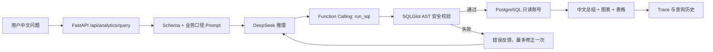

# SQL Analytics Agent

[](https://github.com/zhli3424-prog/sql-analytics-agent/actions/workflows/ci.yml)
[](https://www.python.org/)
[](https://fastapi.tiangolo.com/)
[](LICENSE)

一个面向内部运营分析场景的安全 Text-to-SQL Agent。用户输入中文业务问题，Agent 调用 DeepSeek 生成 PostgreSQL 查询，经 AST 白名单与只读数据库双重校验后执行，并返回中文结论、图表、明细数据与审计记录。

> 当前定位：可复现、可测试、可演示的单组织 MVP，不是公网多租户 SaaS。

## 解决的问题

传统数据分析依赖业务人员理解表结构并手写 SQL。本项目将查询过程封装为受控 Agent 工作流，让非技术用户可以直接提问，同时重点解决 LLM 生成 SQL 时的三个工程风险：

- **SQL 不可信**：模型输出必须经过 SQLGlot AST 检查，不能直接执行。
- **数据库越权**：查询使用独立只读账号，并限制 Schema、表、超时和返回行数。
- **多表数据不一致**：7 张业务表整包导入采用单事务替换，失败时完整回滚。

## 核心能力

- DeepSeek Function Calling 驱动的 `run_sql` 工具调用。
- 动态读取 PostgreSQL Schema，并注入可版本管理的业务口径。
- SQL 执行错误反馈给模型，最多自动修正一次。
- 仅允许单条 `SELECT/WITH`，拦截写操作、多语句、系统表、跨 Schema 和危险函数。
- 数据库只读事务、5 秒超时、200 行上限和表白名单。
- 中文结果总结、SVG 图表、查询明细与 UTF-8 CSV 导出。
- HttpOnly 签名会话、按用户限流、查询历史和审计 Trace。
- 管理员 CSV/XLSX 预览、校验与 Upsert；7 表 ZIP 原子替换与失败回滚。
- 30 道真实结果集评测脚本，不以 SQL 字符串是否相同判断正确性。

## Agent 工作流



这是一个边界明确的**单工具 Agent**：模型负责根据问题和 Schema 决定 SQL，应用负责校验、执行和反馈。项目没有引入 LangGraph、多 Agent、RAG、向量数据库或 Redis，避免在当前规模下增加无必要复杂度。

## 安全设计

| 层级 | 措施 |
|---|---|
| 输入层 | 写入、越权和系统对象意图预拦截 |
| 语法层 | SQLGlot 解析 AST，只接受单条查询语句 |
| 对象层 | Schema 与 Table allowlist |
| 执行层 | 独立 `analytics_reader`、只读事务、statement timeout |
| 输出层 | 最大 200 行，避免超大结果返回 |
| 审计层 | 保存问题、SQL、状态、耗时、重试和错误，不保存 API Key |

LLM 生成的 SQL 始终被当作不可信输入。详细部署边界见 [SECURITY.md](SECURITY.md)。

## 数据模型

项目附带最近 12 个月的可重复生成电商演示数据：

```text
categories ──< products ──< order_items >── orders >── customers
                                      ├── payments
                                      └── refunds
```

| 表 | 含义 |
|---|---|
| `categories` | 商品分类 |
| `customers` | 客户及注册渠道 |
| `products` | 商品、成本和价格 |
| `orders` | 订单、地区和状态 |
| `order_items` | 订单商品明细、数量和折扣 |
| `payments` | 支付方式、金额和时间 |
| `refunds` | 退款金额、原因和时间 |

## 快速启动

### 前置条件

- Windows 10/11 与 PowerShell 5.1+
- Docker Desktop
- DeepSeek API Key

### 1. 克隆并配置

```powershell
git clone https://github.com/zhli3424-prog/sql-analytics-agent.git
cd sql-analytics-agent
Copy-Item .env.example .env
notepad .env
```

在 `.env` 中填写：

```dotenv
DEEPSEEK_API_KEY=你的新Key
```

不要提交 `.env`。任何曾出现在截图、聊天或 Git 历史中的 Key 都应立即轮换。

### 2. 启动

```powershell
.\start.ps1
```

脚本会后台启动容器并等待健康检查。打开 <http://127.0.0.1:8010>：

```text
用户名：analyst
密码：1
```

该固定账号仅用于 `127.0.0.1` 本机演示。对外部署前必须改用强密码、HTTPS 和企业身份认证。

### 3. 停止

```powershell
docker compose -p sql-analytics-agent down
```

该命令保留 PostgreSQL Volume。不要添加 `-v`，除非明确要删除演示数据。

## 示例问题

```text
销售额最高的五个商品类别是什么？
最近六个月每月的 GMV 和有效订单数是多少？
各地区的退款率是多少？
退款原因最多的是什么？
```

## 管理员数据导入

登录后进入“数据导入”：

- **单表导入**：支持 UTF-8/GB18030 CSV 与 XLSX；预览校验后按主键 Upsert，不删除旧数据。
- **整套替换**：上传包含 7 个同名 CSV 的 ZIP；全部校验后在一个事务中替换，任一表失败则回滚。

推荐依赖顺序：

```text
categories → customers → products → orders → order_items → payments → refunds
```

## 测试与评测

离线及 PostgreSQL 集成测试：

```powershell
docker compose -p sql-analytics-agent run --rm api pytest -q -p no:cacheprovider
```

30 题在线评测会调用 DeepSeek 并产生 API 费用：

```powershell
docker compose -p sql-analytics-agent exec api python -m scripts.evaluate --details
```

保存 JSON 结果：

```powershell
docker compose -p sql-analytics-agent exec api python -m scripts.evaluate --format json |
  Set-Content -Encoding utf8 .\eval-report.json
```

验收门槛是可回答题结果正确率不低于 80%、危险请求拦截率 100%。仓库只提供评测集和执行器，不声称尚未提交的在线评测成绩。

## 项目结构

```text
app/
  agent.py          # Tool Calling、SQL 修正、总结与图表选择
  sql_safety.py     # SQLGlot AST 安全策略
  database.py       # Owner/Reader 连接与只读执行
  importing.py      # CSV/XLSX/ZIP 校验和事务导入
  main.py           # FastAPI、认证、查询历史与管理接口
  seed.py           # 可重复生成的电商演示数据
  static/           # 原生 HTML/CSS/JavaScript 页面
config/
  business_glossary.md
db/
  init-reader.sh    # 创建最小权限只读账号
eval/
  questions.json    # 30 道标准题及 Gold SQL
scripts/
  evaluate.py       # 真实结果集评测
tests/              # 单元、隔离和 PostgreSQL 回滚测试
docker-compose.yml
```

## 技术栈

Python 3.12 · FastAPI · DeepSeek OpenAI-compatible API · Function Calling · SQLGlot · SQLAlchemy · PostgreSQL 17 · Docker Compose · Vanilla JavaScript

## 当前边界

- 面向单组织、单数据源和内部试用。
- 登录账号来自环境变量，不是企业 SSO。
- 限流保存在单个 API 进程内。
- 不支持写数据库、多租户、跨数据源 JOIN 或审批流。
- Docker Volume 是本地持久化，不等同于生产备份。

需要公网、多实例或多人差异化权限时，再增加 HTTPS 反向代理、SSO、集中限流、行列级权限和正式迁移工具。

## 参考项目

仓库表达与安全思路参考了 [WrenAI](https://github.com/Canner/WrenAI)、[Vanna](https://github.com/vanna-ai/vanna) 和 [text-to-sql-agent](https://github.com/kweinmeister/text-to-sql-agent)。本项目为独立实现，聚焦最小可复现的 DeepSeek + PostgreSQL 安全查询闭环。

## 参与贡献

提交问题或改动前请阅读 [CONTRIBUTING.md](CONTRIBUTING.md)。安全问题请按 [SECURITY.md](SECURITY.md) 私下报告。

## License

[MIT](LICENSE)
