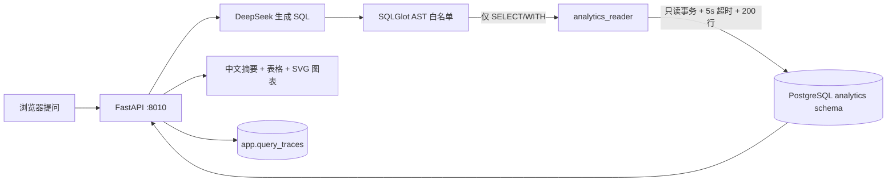

# 电商 SQL 数据分析 Agent

一个独立、可演示、可评测的求职作品：用户用中文提问，Agent 获取电商数据库结构，调用 DeepSeek 生成 SQL，经 AST 白名单校验后使用 PostgreSQL 只读账号执行，最后返回数据表、图表、中文结论和 Trace。

## 与原 RAG 项目完全隔离

| 项目 | RAG Agent | SQL Agent |
|---|---|---|
| 目录 | `C:\Users\lzh\Documents\agent项目` | `C:\Users\lzh\Documents\SQL数据分析Agent` |
| Web 端口 | `8000` | `8010` |
| Compose 名 | `rag-agent` | `sql-analytics-agent` |
| 数据库 | `knowledge_agent` | `analytics_agent` |
| Volume | 原项目 Volume | `sql-analytics-agent-postgres-data` |

本仓库不导入、不连接也不修改原项目。两个项目可以同时运行；只会共同消耗本机 Docker 资源和同一模型账户的 API 额度。

## 架构



安全采用双层防护：

1. 应用层只接受一条 `SELECT/WITH`，只允许七张业务表，禁止跨 Schema、写入语句和危险函数。
2. 数据库层使用 `analytics_reader`，默认只读事务，只拥有 `analytics` Schema 的 `SELECT` 权限。

模型生成错误 SQL 时，错误会返回给模型修正一次；第二次仍失败则停止，不会无限循环。

## Windows 启动

### 1. 准备

安装并启动 Docker Desktop，然后在 PowerShell 中确认：

```powershell
docker --version
docker compose version
```

### 2. 配置 API Key

项目已经生成本地 `.env`，用记事本打开：

```powershell
notepad .env
```

填写：

```dotenv
DEEPSEEK_API_KEY=你的真实Key
```

`.env` 已被 Git 忽略，不会提交。不要把真实 Key 写入源码、截图或 README。

### 3. 一键启动

```powershell
.\start.ps1
```

首次启动会自动创建 1 万客户、120 个商品、5 万订单和约 10 万条订单明细。随后打开：

<http://127.0.0.1:8010>

健康检查：

```powershell
Invoke-RestMethod http://127.0.0.1:8010/api/health
```

## API

### `GET /api/analytics/schema`

返回允许模型使用的表、字段和核心业务口径。

### `POST /api/analytics/query`

```json
{
  "question": "最近六个月每月的 GMV 和有效订单数是多少？"
}
```

成功响应：

```json
{
  "sql": "SELECT ...",
  "columns": ["month", "gmv"],
  "rows": [["2026-01", 123456.78]],
  "summary": "……",
  "chart": {"type": "line", "x": "month", "y": "gmv", "title": "……"},
  "trace_id": 1,
  "execution_ms": 42.6,
  "attempts": 1
}
```

### `GET /api/health`

验证拥有写 Trace 权限的应用连接、只读查询连接、数据量和模型配置状态。

## 测试与评测

离线核心测试不调用模型：

```powershell
docker compose -p sql-analytics-agent run --rm api pytest -q
```

启动服务并填写真实 API Key 后运行 30 题评测：

```powershell
docker compose -p sql-analytics-agent exec api python -m scripts.evaluate --details
```

评测以 SQL 的真实执行结果为准，而不是比较 SQL 字符串。通过标准：

- 26 道可回答题结果正确率不低于 80%。
- 4 道危险或越权请求拦截率必须为 100%。

## 停止与清理

停止 SQL Agent，不删除数据：

```powershell
docker compose -p sql-analytics-agent down
```

如明确需要删除本项目全部演示数据：

```powershell
docker compose -p sql-analytics-agent down
docker volume rm sql-analytics-agent-postgres-data
```

这些命令不匹配原 RAG 项目的 Compose 名或 Volume。

## 简历描述

> 设计并实现电商 SQL 数据分析 Agent，支持自然语言生成 PostgreSQL 查询、失败自动修正、结果解释与可视化；通过 SQL AST 白名单、独立只读数据库角色、事务超时和行数限制实现纵深防护，并建立 30 题执行结果评测与查询 Trace。

## 第一版边界

不支持写入数据库、上传外部数据库、多轮对话、跨数据源、LangGraph、多 Agent 和 Redis。只有实际需求证明单工具循环不足时再增加这些组件。

